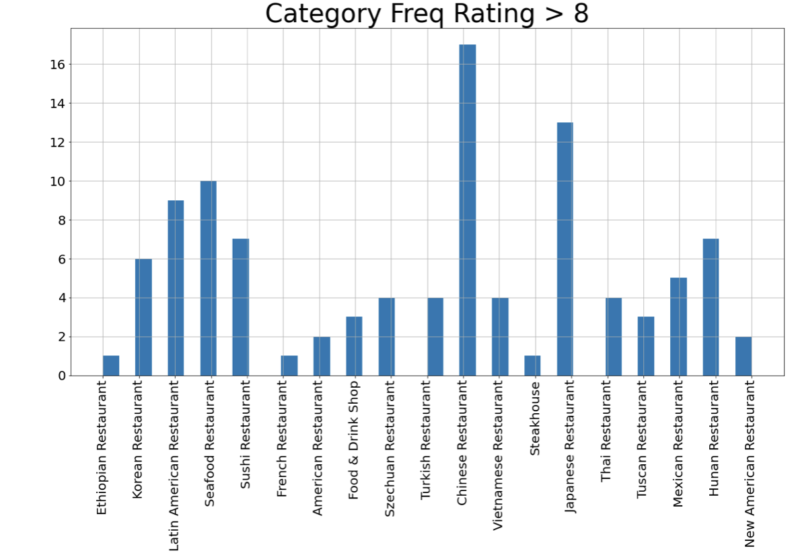
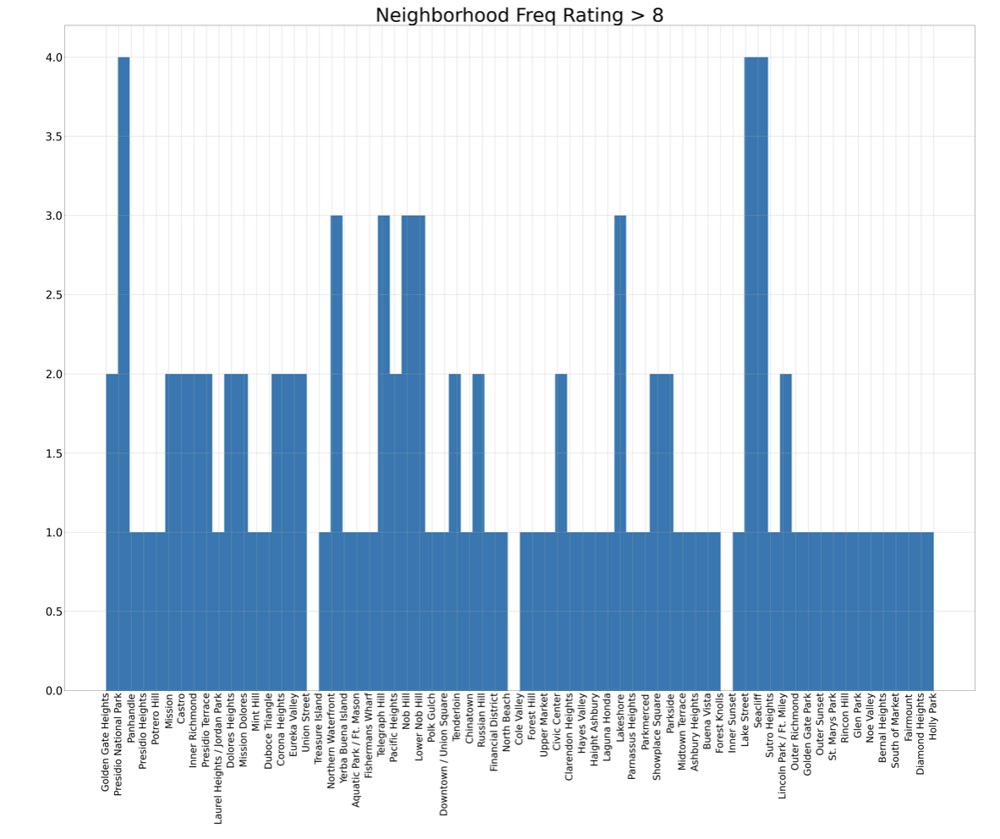
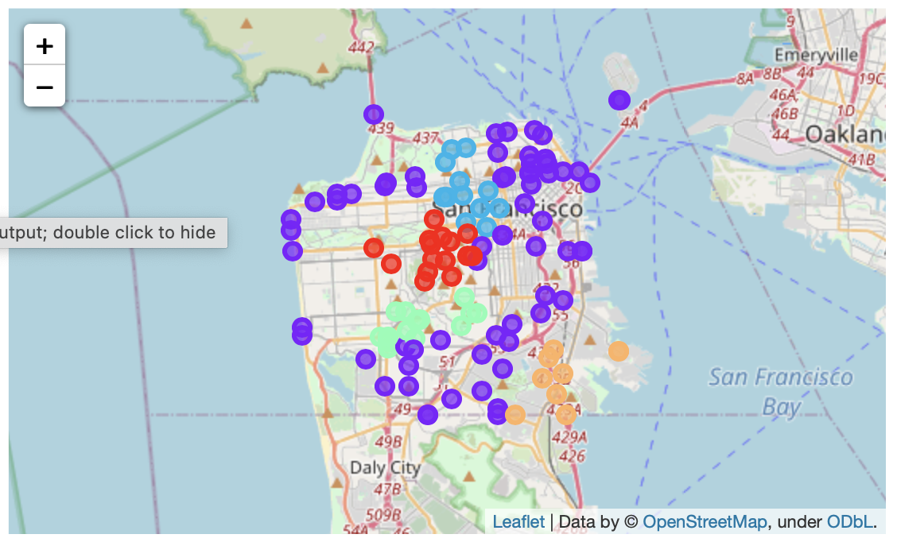
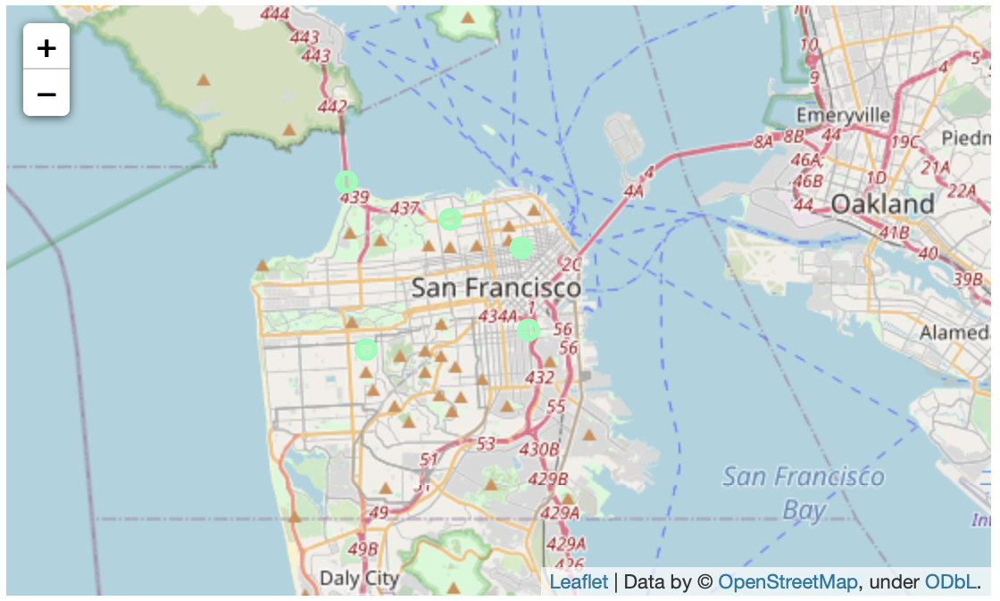

<h1><font color='Teal'>Identifying Best Venue Location in San Francisco:</font></h1> 

<h1>1. Introduction: </h1>
<body>
San Francisco has been dubbed the center of bohemianism. With writers such as Mark Twain and Jack London and other poets in 1950s making their best work. Then in the 1980s, a tech boom emerged in Silicon Valley allowing for transformative growth. Due to this, there have been more people moving into San Francisco with different backgrounds. The focus of the report will be on small foodie businesses, with the intent to find the best location for a food business. 

FourSquare API allows a developer find the nearby venues to a pair of certain coordinates that you declare. In that, to find the best location to yield the most revenue, we will analyze the venues in San Francisco with the highest ratings. The following methods used will include k-means clustering. 

Objective of the analysis is to find the best venue location for an upcoming entrepreneur who is looking for the best yields. </body>

<h1>2. Data Acquisition and Cleaning:</h1>

Based on the nature of the problem, there are many variables that will influence our decision, such as: 
* Number of existing restaurants in the specific neighborhoods
* Ratings of the restaurant
Each neighborhood will act as a center to find the nearest restaurants near that particular neighborhood. 

<h3>2.1 Data Sources</h3>
The following data sources that will need to be extracted/generated will be:
* the Latitude and Longitude of each neighborhood will be obtained using **Google Maps API geocodings**
* Number of restaurants, ratings, and category will be obtained using **FourSquare API**
* Data will be webscrapped from the following link <a href = "https://data.sfgov.org/Geographic-Locations-and-Boundaries/SF-Find-Neighborhoods/pty2-tcw4" target = "_blank">SFDATA</a>

<h3> 2.2 Data Cleaning </h3>
The data downloaded was cleaned by extracting neighborhood name, latitude, and longitude from the json file and then stored into a dataframe. Although, each neighborhood contained multiple coordinates, in that, decided to use the first index for each neighborhood. 

When it came to calling the FourSquare API, the main issue that arose was the fact that the data contained empty indices. In that, passed the data into conditional statements to replace any of the empty indices with a 'None' string. In addition, while finding the ratings for each restaurant, the same issue occurred. Thus, each of the empty indices were replaced with a zero rating although, it would not be representative of the restaurants success. The justification made for this, was that the restaurants that were not yet rated were perhaps too young to determine their success. In that, the project is aiming in finding the best venues to reflect the best location of where to erect a new restaurant. 

<h1> 3. Exploratory Analysis</h1> 
<h3> 3.1 Sorting Ratings </h3> 
The Ratings dataframe had plenty of overlap in terms of the restaurants in different neighborhoods, while sorting the data from highest rating to lowest. 
The average rating amongst 366 rows of data, is 6.59. Though, this is only true for less than 30% of the data, and the data starts converging at the 75% quantile at 8.1. The max rating of the data set is given to the "New Eritrea Restaurant & Bar" with a rating of 9.1. 

<h3> 3.2 Correlation between Category and Rating</h3> 
By taking into account the type of restaurant, we can plot a histogram of to return the frequency of the category of restuarant for ratings greater than 8. 

From the Frequency plot, we can see the top 3 restaurant categories are Chinese Restaurants, Seafood Restaurants, and Japanese Restaurants. 

<h3> 3.3 Correlation between Neighborhood and Rating</h3> 
To determine which neighborhoods had the most rated restaurants, a histogram was plotted with the Neighborhoods that contained restaurants rated 8 or greater. On the histogram, we can see that Presidio National Park, Lake Street, and Seacliff contained the higher rated restaurants. 


<h1>4. Cluster Modeling</h1> 
Clustering is an unsupervised machine learning approach, and despite its simplicity, the K-means is vastl used for clustering in many data science applicatins, especially useful if you need to quickly discover insights from unlabeled data.
<h3>K-Means Clustering</h3> 
The problem was aiming to cluster the neighborhoods based on the frequency of a specific restaurant in a neighborhood. By setting the number of clusters to 5, we can visualize the San Francisco City through folium. Through this visualization, we can determine the best location to open a new business. 

From here, I took the top 5 points from the clusters with the highest rating and extracted it to another dataframe. The locations i've extracted are the following: Presidio National Park, Union Street, Lower Nob Hill, Nob Hill, and Potrero Hill. 


<h1>Discussion</h1> 
Based on the second folium plot and the initial exploratory anlaysis there exists an overlap between the two analysis. In that, the best location for a new venue will be at Presidio National park, because of the high frequency of high ratings during the exploratory analysis. In terms of the category of the restaurant, the best possible option would be to open either a Chinese, Japanese, and or a Seafood restaurant.  

<h1> Conclusion</h1> 
Opening a restaurant in San Francisco will be a great investment, in that, you can expect many visitors from all around Silicon Valley. And also, since San Francisco has a high tourist attraction rate from across the world, you can expect a concentrated foot traffic in the areas stated in the discussion section during the holidays. 


```python

```
